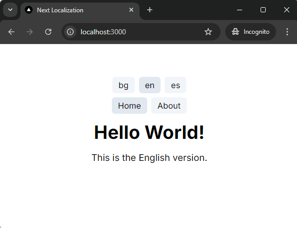

# Simple Next.js Localization

Setup for **static sites** with clean default locale URLs (not containing the locale code).

- ✅ Site is completely static (`output: 'export'`)
- ✅ Default locale has bare URL, for example:
  - https://example.com/about — default locale
  - https://example.com/es/about — translation 1
  - https://example.com/bg/about — translation 2
- ✅ HTML `lang` attribute generated correctly (https://github.com/vercel/next.js/discussions/49415)
- ✅ No external dependencies used, only bare Next.js

**Full explanation here:** [dodov.dev/blog/how-to-set-up-simple-nextjs-localization](https://dodov.dev/blog/how-to-set-up-simple-nextjs-localization?utm_source=nextjs-simple-localization&utm_content=readme)

## Preview

1. `git clone git@github.com:hdodov/nextjs-simple-localization.git`
1. `cd nextjs-simple-localization && npm i`
1. `npm run dev`
1. http://localhost:3000

